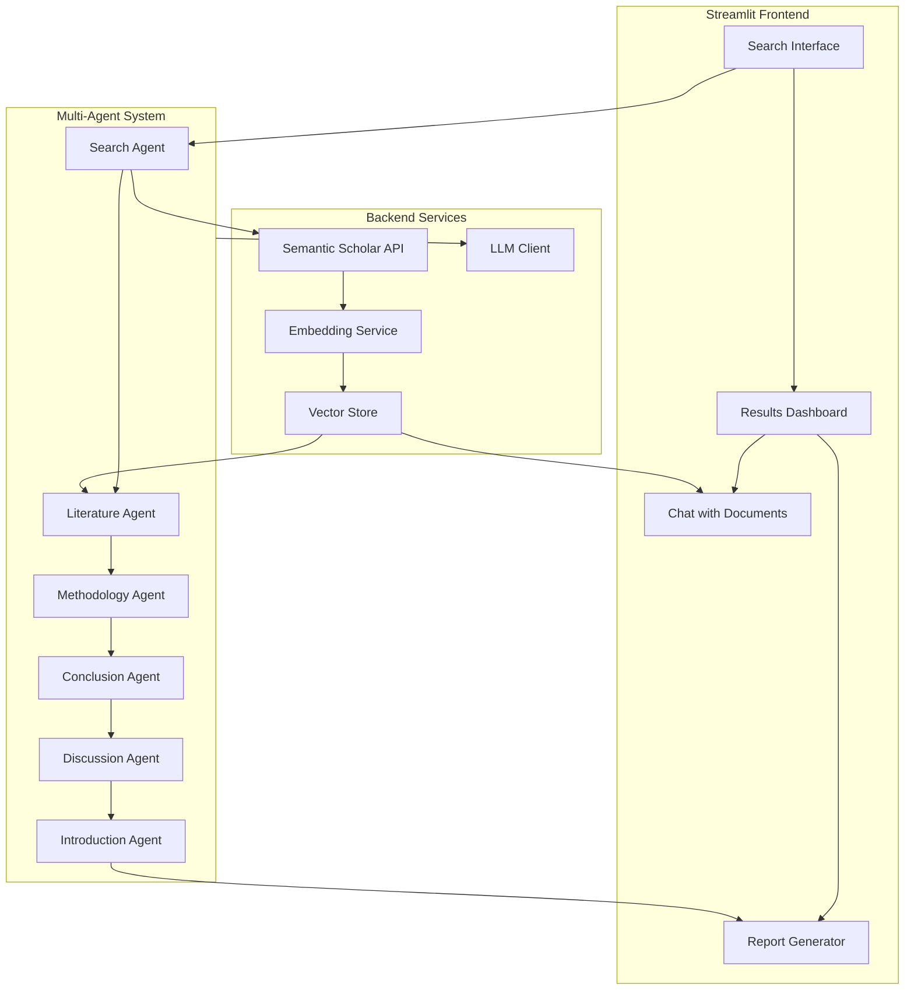

# Research Paper Discovery System

> AI-powered academic paper discovery and analysis platform with a multi-agent architecture. Search, analyze, and generate research reports using semantic search and LLM-powered agents.


---

## What It Does

Upload a research topic or question, and the system:

1. **Discovers** relevant papers via Semantic Scholar API
2. **Analyzes** papers using specialized AI agents (methodology, literature, conclusion)
3. **Generates** a structured research report with citations
4. **Enables** chat-based Q&A over discovered papers

---

## Architecture



---

## Key Features

| Feature | Description |
|---------|-------------|
| **Multi-Agent Analysis** | 6 specialized agents analyze different aspects of papers |
| **Semantic Search** | Embedding-based paper discovery via Semantic Scholar |
| **Document Chat** | Ask questions about discovered papers with RAG |
| **Report Generation** | Auto-generated structured research reports |
| **Quality Scoring** | Papers ranked by relevance and quality metrics |
| **Web Scraping** | Full-text extraction when available |

---

## Agent Roles

| Agent | Responsibility |
|-------|---------------|
| **Search Agent** | Query expansion and paper retrieval from Semantic Scholar |
| **Literature Agent** | Related work analysis and gap identification |
| **Methodology Agent** | Methodology extraction and comparison |
| **Conclusion Agent** | Key findings synthesis |
| **Discussion Agent** | Implications and future direction analysis |
| **Introduction Agent** | Topic overview and report compilation |

---

## Quick Start

### Prerequisites
- Python 3.11+
- Semantic Scholar API key (optional, increases rate limits)

### Setup

```bash
git clone https://github.com/Nagavenkatasai7/Research-Paper-Discovery-System.git
cd Research-Paper-Discovery-System
python -m venv venv
source venv/bin/activate
pip install -r requirements.txt
```

### Configure

```bash
cp .env.example .env
# Edit .env with your API keys
```

### Run

```bash
streamlit run app.py
```

---

## Tech Stack

| Component | Technology |
|-----------|-----------|
| Language | Python 3.11+ |
| Frontend | Streamlit |
| Search API | Semantic Scholar |
| Embeddings | Sentence Transformers |
| LLM | OpenAI GPT-4o / Grok |
| Database | SQLite (paper metadata) |
| Testing | pytest (30+ test files) |

---

## Project Highlights

- **6 specialized AI agents** working in a pipeline architecture
- **Semantic Scholar integration** for real academic paper discovery
- **30+ test files** covering unit, integration, and end-to-end scenarios
- **Production-ready** with error handling, logging, and deployment docs
- **4-week phased development** from MVP to production

---

## License

MIT — see [LICENSE](LICENSE) for details.
